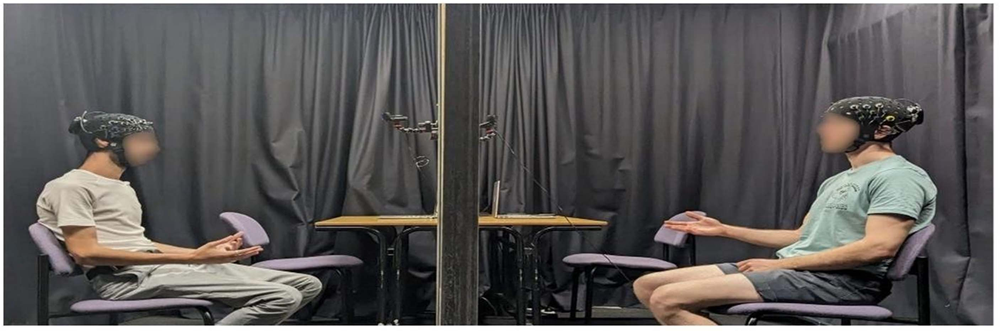
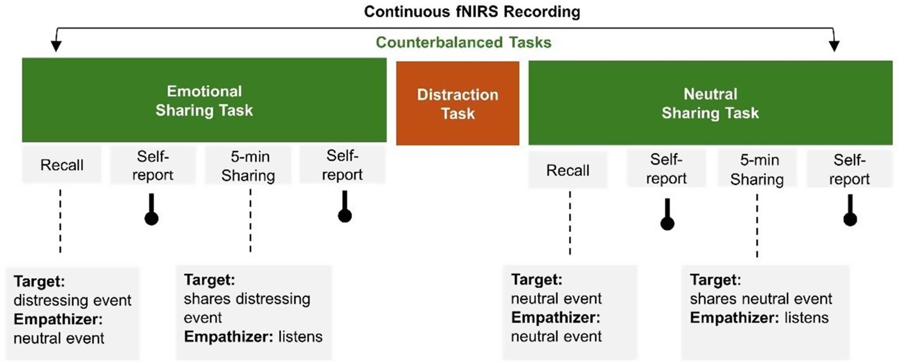
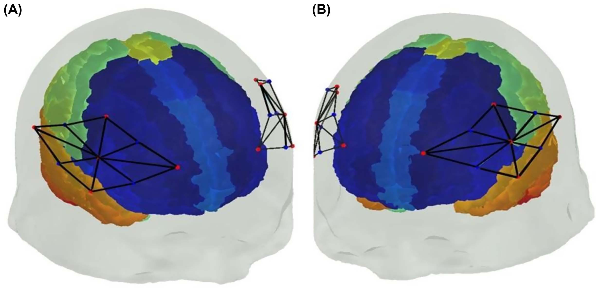
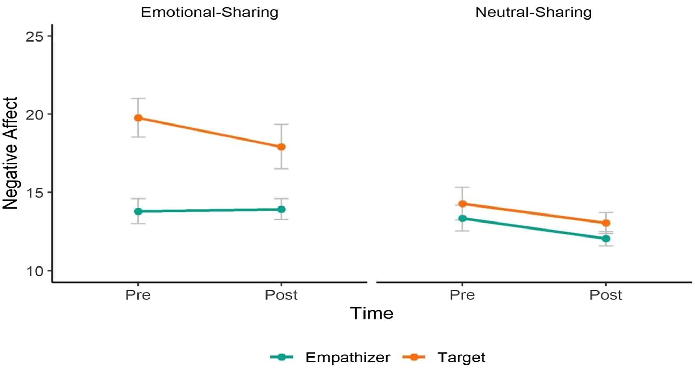
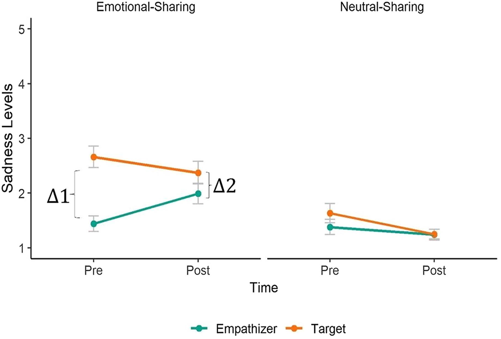
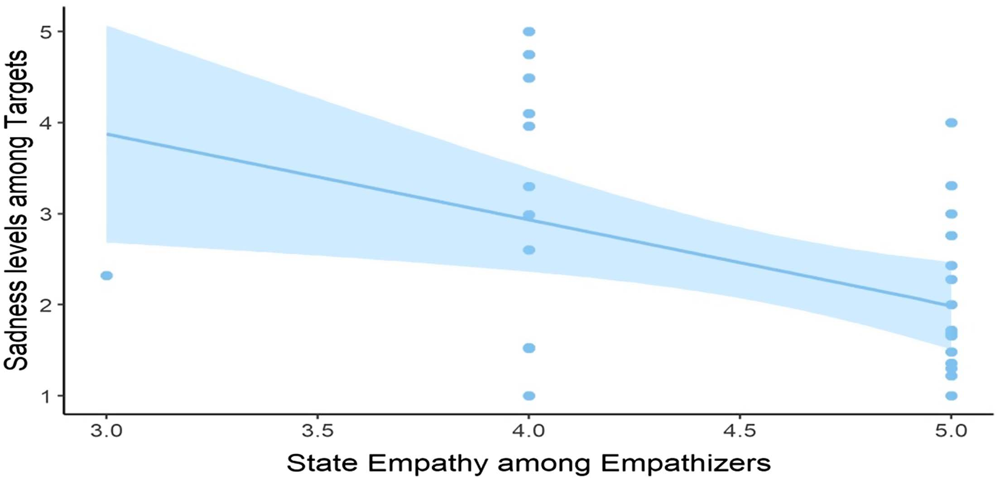
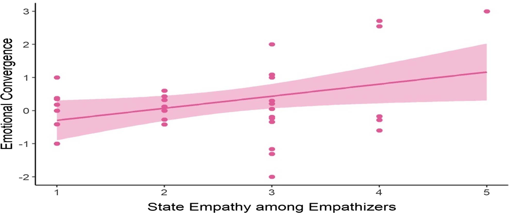
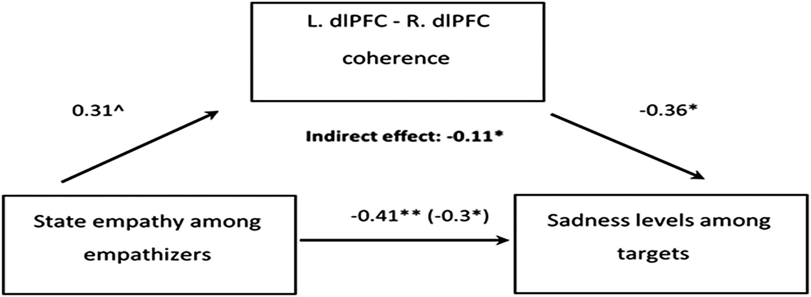

# É Preciso Dois para se Empatizar: O Acoplamento Intercerebral Contribui para a Regulação do Estresse

  

> **Autores:** Yarden Avnor, Dovrat Atias, Andrey Markus, Simone Shamay-Tsoory  
> **Publicado em:** *Emotion*, 25(3), 736–754 (2025)  
> **DOI:** [10.1037/emo0001431](https://doi.org/10.1037/emo0001431)
> **Afiliação:** Departamento de Psicologia, Universidade de Haifa.

---

## 📄 Resumo (Abstract)

Enquanto as pesquisas existentes sobre empatia focam nas respostas de um observador ao sofrimento de outro, este estudo investiga como a **interação diádica** contribui para a regulação do estresse. Propomos que o acoplamento comportamental e neural durante interações empáticas é fundamental para diminuir o sofrimento.

Através de espectroscopia funcional no infravermelho próximo (fNIRS), medimos o acoplamento intercerebral em sistemas de regulação emocional (**dlPFC**) e observação-execução (**IFG**).

**Principais Descobertas:**
- **Convergência Emocional:** Alvos e empatizadores sincronizam seus estados afetivos durante a conversa.
- **Predição de Alívio:** Níveis de empatia (especialmente tomada de perspectiva) prevêem o alívio do estresse do alvo.
- **Mecanismo Neural:** O acoplamento no **dlPFC** media a relação entre a empatia do observador e o alívio do estresse do alvo.

---

## 🧠 Visão Geral da Pesquisa

### 1. Introdução e Contexto
A empatia não é apenas sentir o que o outro sente, mas um processo evolutivo de aliviar o sofrimento alheio. O estudo utilizou uma tarefa de compartilhamento emocional face a face para observar como dois cérebros se "sintonizam".

  
   <em>Figura 1: Configuração experimental com participantes frente a frente utilizando fNIRS.</em>

### 2. Metodologia
O experimento envolveu 37 pares (N=74) que realizaram tarefas de compartilhamento emocional (eventos tristes biográficos) e neutros (rotina diária).

  

As áreas cerebrais monitoradas incluíram o **Giro Frontal Inferior (IFG)**, o **Córtex Pré-frontal Dorsolateral (dlPFC)** e o **Córtex Pré-motor**.

  

---

## 📊 Resultados Principais

### Convergência Comportamental
Os alvos apresentaram níveis significativamente maiores de afeto negativo na tarefa emocional, validando a indução de estresse.

  

Observou-se uma **convergência das níveis de tristeza**: a lacuna emocional inicial entre os participantes desapareceu ao final da interação emocional.

  

### O Papel da Empatia
A **Tomada de Perspectiva** do empatizador foi o melhor preditor para a redução da tristeza do alvo.

  

### Acoplamento Intercerebral
Pares reais mostraram acoplamento significativamente maior do que pares aleatórios (pseudodyads) em 12 combinações de regiões de interesse.

  

---

## 🧬 Conclusão e Mediação Neural

O estudo concluiu que o acoplamento no **dlPFC Esquerdo - dlPFC Direito** media parcialmente como a empatia se traduz em regulação emocional diádica.

  
   <em>Figura 9: O dlPFC como mediador entre empatia e alívio do estresse.</em>

---

## 📚 Referências Selecionadas

1. **Avnor, Y., Atias, D., Markus, A., & Shamay-Tsoory, S. (2025).** It takes two to empathize: Interbrain coupling contributes to distress regulation. *Emotion*, 25(3), 736–754.
2. **Decety, J., & Lamm, C. (2006).** Human empathy through the lens of social neuroscience. *The Scientific World Journal*, 6, 1146–1163.
3. **Goldstein, P., et al. (2018).** Brain-to-brain coupling during handholding is associated with pain reduction. *PNAS*, 115(11), E2528–E2537.
4. **Morawetz, C., et al. (2022).** Reappraisal and empathic perspective-taking—More alike than meets the eyes. *NeuroImage*, 255, 119194.
5. **Shamay-Tsoory, S. G. (2011).** The neural bases for empathy. *The Neuroscientist*, 17(1), 18–24.
6. **Zaki, J. (2020).** Integrating empathy and interpersonal emotion regulation. *Annual Review of Psychology*, 71(1), 517–540.

---

## 📂 Organização do Repositório

- `Interbrain_Coupling_Study.pdf`: Artigo completo original.
- `Interbrain_Coupling_Study.txt`: Texto extraído do PDF para processamento.
- `assets/`: Pasta com figuras de alta qualidade extraídas.
- `readme.md`: Este documento detalhado.
- `extract_assets.py`: Script autoral para extração de mídia do PDF.
