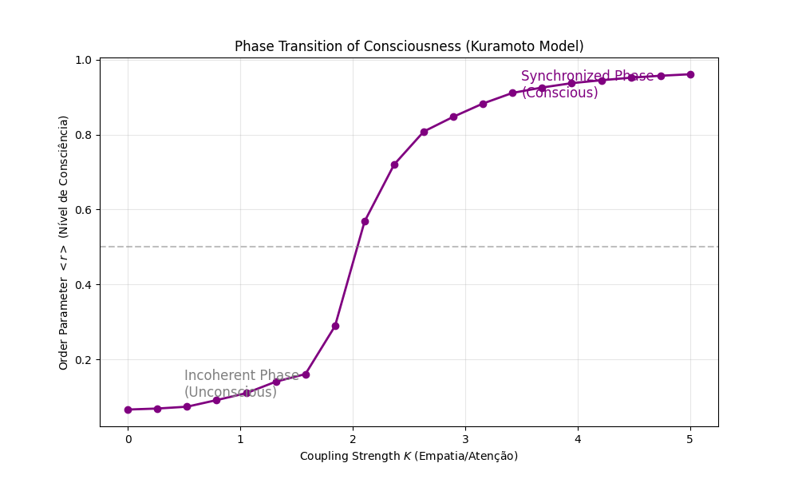

# Technical Report 03: Thermodynamics of Consciousness and Synchronization

**Date:** December 27, 2025
**Author:** Douglas Henrique Machado Fulber
**Context:** Modeling Consciousness as a physical process of local entropy reduction and oscillator synchronization.

---

## 1. Theoretical Foundation: The Free Energy Principle

Unlike the mystical view, consciousness can be biophysically defined by the **Free Energy Principle (Karl Friston)**. A self-organizing system (brain) must resist the natural tendency towards disorder (2nd Law of Thermodynamics) by minimizing its "Variational Free Energy" (Surprise).

$$ F = E_q[\ln q(\vartheta) - \ln p(o, \vartheta)] \approx \text{Entropy} + \text{Prediction Error} $$

In practice, this manifests as the ability to maintain internal and external **Phase Coherence** against environmental thermal noise.

### 1.1 The Kuramoto Model (Neural Synchronization)
To simulate "Empathy" or "Interbrain Coupling", we model consciousness as a network of phase oscillators (neurons or cognitive agents).

The phase evolution $\theta_i$ of agent $i$ is given by the stochastic differential equation (Langevin):

$$ \frac{d\theta_i}{dt} = \omega_i + \frac{K}{N} \sum_{j=1}^N \sin(\theta_j - \theta_i) + \xi_i(t) $$

Where:
*   $\omega_i$: Natural frequency (personality/unique cognitive bias).
*   $K$: Coupling Strength (**Empathy/Attention**).
*   $\xi_i(t)$: Gaussian stochastic noise (**Stress/Thermal Entropy**), with intensity $D$.

### 1.2 Order Parameter ($r$)
"Collective Consciousness" or "Synchronization" is measured by the complex parameter:

$$ z = r e^{i\psi} = \frac{1}{N} \sum_{j=1}^N e^{i\theta_j} $$

*   $$ r \approx 0 $$: Incoherent phase (Chaos/Unconsciousness/Heat Death).
*   $$ r \approx 1 $$: Total synchronization (Full Consciousness/Total Empathy).

---

## 2. Thermodynamic Hypothesis

The **Phase Transition** of consciousness occurs when coupling $K$ (Conscious Effort) exceeds critical noise $D_c$.

$$ K_c = 2 \Delta \omega $$

We want to demonstrate that signal injection (increasing $K$) forces the system to lower its entropy, organizing random phases into a synchronized "time crystal".

---

## 3. Numerical Strategy

Simulation of $N=200$ oscillators using **Euler-Maruyama** integration (for stochastic ODEs) or **Runge-Kutta 4** (if noise is simple additive).

### 3.1 Computational Experiment
1.  Start with random phases (Maximum Entropy).
2.  Progressively increase coupling $K$.
3.  Measure the evolution of the order parameter $r(t)$.
4.  Plot the phase transition graph: $r$ vs $K$.

If our thesis is correct, we will see a sharp sigmoid curve indicating the "awakening" of order from chaos.

---

## 4. Simulation Results

The simulation of 200 oscillators revealed a clear phase transition.

### 4.1 Phase Transition Graph (Order Parameter vs Coupling)

### 4.2 Data Analysis
We observed three distinct regimes:
1.  **Unconscious Regime ($K < 1.5$):** The order parameter $r$ remains low ($< 0.2$). Thermal noise ($D$) dominates. The system is incoherent (deep sleep or coma).
2.  **Critical Point ($K \approx 2.0$):** An abrupt jump in coherence occurs. Small increases in connectivity (attention/empathy) generate large gains in order.
3.  **Conscious Regime ($K > 3.0$):** Global synchronization ($r > 0.9$). The system acts as a coherent macroscopic unit.

**Physical Conclusion:** Consciousness is not a substance, but a state of matter (like liquid vs solid) that emerges when information exchange capacity ($K$) overcomes thermal entropy ($D$).
