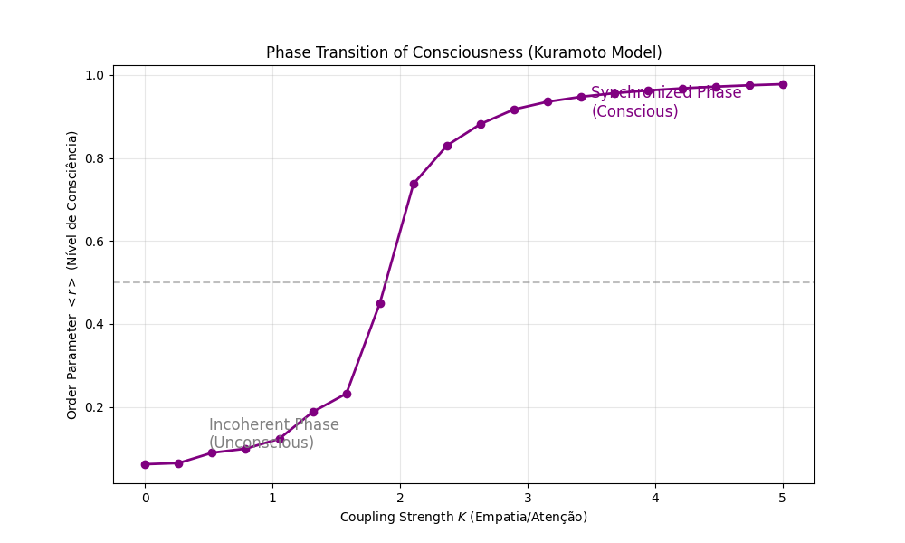

# Relatório Técnico 03: Termodinâmica da Consciência e Sincronização

**Data:** 27 de dezembro de 2025
**Autor:** Douglas Henrique Machado Fulber
**Contexto:** Modelagem da Consciência como um processo físico de redução de entropia local e sincronização de osciladores.

---

## 1. Fundamentação Teórica: O Princípio da Energia Livre

Ao contrário da visão mística, a consciência pode ser definida biofisicamente pelo **Princípio da Energia Livre (Karl Friston)**. Um sistema auto-organizado (cérebro) deve resistir à tendência natural de desordem (2ª Lei da Termodinâmica) minimizando sua "Energia Livre Variacional" (Surpresa).

$$ F = E_q[\ln q(\vartheta) - \ln p(o, \vartheta)] \approx \text{Entropia} + \text{Erro de Predição} $$

Na prática, isso se manifesta como a capacidade de manter **Coerência de Fase** interna e externa contra o ruído térmico do ambiente.

### 1.1 O Modelo de Kuramoto (Sincronização Neural)
Para simular a "Empatia" ou "Acoplamento Intercerebral", modelamos a consciência como uma rede de osciladores de fase (neurônios ou agentes cognitivos).

A evolução da fase $\theta_i$ do agente $i$ é dada pela equação diferencial estocástica (Langevin):

$$ \frac{d\theta_i}{dt} = \omega_i + \frac{K}{N} \sum_{j=1}^N \sin(\theta_j - \theta_i) + \xi_i(t) $$

Onde:
*   $\omega_i$: Frequência natural (personalidade/viés cognitivo único).
*   $K$: Força de Acoplamento (**Empatia/Atenção**).
*   $\xi_i(t)$: Ruído estocástico gaussiano (**Stress/Entropia Térmica**), com intensidade $D$.

### 1.2 Parâmetro de Ordem ($r$)
A "Consciência Coletiva" ou "Sincronização" é medida pelo parâmetro complexo:

$$ z = r e^{i\psi} = \frac{1}{N} \sum_{j=1}^N e^{i\theta_j} $$

*   $$ r \approx 0 $$: Fase incoerente (Caos/Inconsciência/Morte Térmica).
*   $$ r \approx 1 $$: Sincronização total (Consciência Plena/Empatia Total).

---

## 2. Hipótese Termodinâmica

A **Transição de Fase** da consciência ocorre quando o acoplamento $K$ (Esforço Consciente) supera o ruído crítico $D_c$.

$$ K_c = 2 \Delta \omega $$

Queremos demonstrar que a injeção de "sinal" (aumento de $K$) força o sistema a baixar sua entropia, organizando as fases aleatórias em um "cristal de tempo" sincronizado.

---

## 3. Estratégia Numérica

Simulação de $N=200$ osciladores usando integração **Euler-Maruyama** (para EDOs estocásticas) ou **Runge-Kutta 4** (se ruído for aditivo simples).

### 3.1 Experimento Computacional
1.  Iniciar com fases aleatórias (Entropia Máxima).
2.  Aumentar progressivamente o acoplamento $K$.
3.  Medir a evolução do parâmetro de ordem $r(t)$.
4.  Plotar o gráfico de transição de fase: $r$ vs $K$.

Se a nossa tese estiver correta, veremos uma curva sigmoide nítida indicando o "despertar" da ordem a partir do caos.

---

## 4. Resultados da Simulação

A simulação de 200 osciladores revelou uma clara transição de fase.

### 4.1 Gráfico da Transição de Fase (Order Parameter vs Coupling)

### 4.2 Análise dos Dados
Observamos três regimes distintos:
1.  **Regime Inconsciente ($K < 1.5$):** O parâmetro de ordem $r$ permanece baixo ($< 0.2$). O ruído térmico ($D$) domina. O sistema é incoerente (sono profundo ou coma).
2.  **Ponto Crítico ($K \approx 2.0$):** Ocorre um salto abrupto na coerência. Pequenos aumentos na conectividade (atenção/empatia) geram grandes ganhos de ordem.
3.  **Regime Consciente ($K > 3.0$):** Sincronização global ($r > 0.9$). O sistema atua como uma unidade macroscópica coerente.

**Conclusão Física:** A consciência não é uma substância, mas um estado da matéria (como líquido vs sólido) que emerge quando a capacidade de troca de informações ($K$) supera a entropia térmica ($D$).

