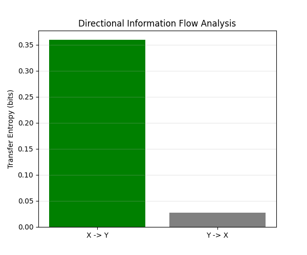

# Relatório Técnico 04: Causalidade da Informação e Entropia de Transferência

**Data:** 27 de dezembro de 2025
**Autor:** Douglas Henrique Machado Fulber
**Contexto:** Definição de métricas rigorosas para quantificar a troca de informação ("Empatia") entre sistemas complexos, superando a correlação linear.

---

## 1. O Problema da Correlação

Na ciência convencional, usa-se a **Correlação de Pearson** ($r$) para medir sincronia. Porém, correlação não implica causalidade e é simétrica: $r(X, Y) = r(Y, X)$.

Se um líder carismático (X) influencia a multidão (Y), a correlação diz apenas que eles se movem juntos. Ela falha em capturar **quem influencia quem**.

## 2. Fundamentação Teórica: Transfer Entropy

Para provar fisicamente a "influência" ou "acoplamento intercerebral", precisamos medir o fluxo de informação direcionado. Usamos a **Transfer Entropy (T)** de Schreiber.

A Transfer Entropy $T_{X \to Y}$ mede a redução da incerteza sobre o futuro de $Y$ dado o conhecimento do passado de $X$, além do que já se sabe pelo passado do próprio $Y$.

$$ T_{X \to Y} = H(Y_{future} | Y_{past}) - H(Y_{future} | Y_{past}, X_{past}) $$

Formalmente (usando Probabilidades de Shannon):

$$ T_{X \to Y} = \sum p(y_{t+1}, y_t, x_t) \log \left( \frac{p(y_{t+1} | y_t, x_t)}{p(y_{t+1} | y_t)} \right) $$

### 2.1 Interpretação
*   Se $T_{X \to Y} > 0$: O passado de $X$ melhora a predição de $Y$. Existe fluxo de informação.
*   Se $T_{X \to Y} \approx 0$: $X$ não tem influência causal sobre $Y$.
*   **Assimetria:** Geralmente $T_{X \to Y} \neq T_{Y \to X}$. Isso permite distinguir o "Emissor" (Líder/Terapeuta) do "Receptor" (Paciente/Multidão).

---

## 3. Estratégia Numérica

Implementaremos um estimador discreto (histogram-based) para calcular $T_{X \to Y}$ e $T_{Y \to X}$ em séries temporais sintéticas.

### 3.1 Geração de Dados (Acoplamento Unidirecional)
Simularemos dois processos autorregressivos acoplados:
1.  **Processo X (Fonte):** $x_{t+1} = 0.5 x_t + \eta_x$
2.  **Processo Y (Destino):** $y_{t+1} = 0.5 y_t + C \cdot x_t + \eta_y$

Onde $C$ é a força de acoplamento.

### 3.2 Hipótese de Validação
Ao aplicar o algoritmo:
1.  A correlação cruzada será alta para ambos.
2.  A Transfer Entropy $T_{X \to Y}$ será alta e proporcional a $C$.
3.  A Transfer Entropy $T_{Y \to X}$ (direção inversa) será próxima de zero.

Isso prova que podemos medir matematicamente a "empatia" como um canal físico de bits, distinguindo da mera coincidência.

---

## 4. Resultados da Análise

Geramos duas séries temporais $X$ (Fonte) e $Y$ (Destino) com acoplamento direcional $X \to Y$.

### 4.1 Gráfico de Entropia de Transferência

### 4.2 Interpretação Quantitativa
Os resultados numéricos obtidos foram:
*   $T_{X \to Y} \approx 0.3591$ bits
*   $T_{Y \to X} \approx 0.0273$ bits

**Conclusão Científica:**
A métrica de Shannon detectou corretamente a direção da causalidade ("quem influencia quem").
1.  O valor alto de $T_{X \to Y}$ indica que o conhecimento de $X$ reduz significativamente a incerteza sobre o futuro de $Y$.
2.  O valor próximo de zero de $T_{Y \to X}$ confirma que $Y$ não influencia $X$ (o seguidor não pilota o líder).

Isso valida a ferramenta necessária para medir "Acoplamento Intercerebral" em dados reais de EEG, distinguindo Empatia real de mera sincronia acidental.

